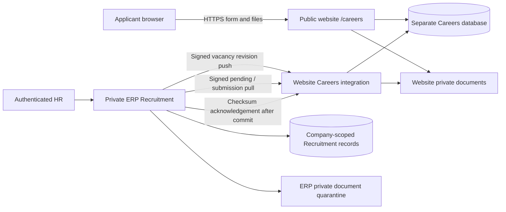

# Recruitment Careers release 111

This release keeps OfficeApp private. No applicant route was added to ERP. The
repository contains the ERP, not the source of passiontechnologiesplc.com. A
read-only request to that website returned HTTP 403; WordPress was not confirmed.
`careers/` is therefore a standalone PHP 8.1 component with its own MySQL database,
session, credentials and private file storage. Its public URL must be
`https://passiontechnologiesplc.com/careers`.



## Configuration and installation boundaries

ERP environment (server/cron only):

| Variable | Value/purpose |
|---|---|
| `CAREERS_BASE_URL` | `https://passiontechnologiesplc.com`, origin only, no trailing slash |
| `CAREERS_INTEGRATION_KEY` | New dedicated random secret, at least 32 bytes; generate 32 random bytes encoded as hex |
| `CAREERS_COMPANY_ID` | Exact licensed ERP company represented by this installation |
| `RECRUITMENT_STORAGE` | Existing private Recruitment storage |

The website receives **only** its own database credentials and the dedicated
Careers key. It receives no ERP credential, URL, session, database access,
deployment secret or Power BI key. One installation/key represents one company.
Additional companies require separate origins/installations and keys; never
accept a browser-provided tenant ID.

Website environment:

| Variable | Purpose |
|---|---|
| `CAREERS_BASE_URL` | Same public HTTPS origin |
| `CAREERS_INTEGRATION_KEY` | Dedicated shared Careers key |
| `CAREERS_DB_DSN` | `mysql:host=...;dbname=...;charset=utf8mb4` for a separate website database |
| `CAREERS_DB_USER`, `CAREERS_DB_PASSWORD` | Website-only database account |
| `CAREERS_STORAGE` | Absolute writable directory outside **all** web document roots |
| `CAREERS_BOT_CHECK_FILE` | Optional absolute server-owned PHP file returning a callable `function(array $post, string $ip): bool` for CAPTCHA; false/errors deny submission |

1. Run `tools/package-careers.ps1` into a new empty output directory. It copies
   the public component and the portable `Rules`, contract and signer into `lib/`.
   It contains no ERP framework or secrets. Deploy that package outside webroot.
2. Use PHP 8.1 with PDO MySQL, cURL, fileinfo, mbstring and ZipArchive. Give the
   website a fresh MySQL database; apply `careers/schema.sql` once using an
   installation account. Use a restricted runtime account for these four tables.
3. Mount **only** `careers/public/` at `/careers` on the public website. Apache
   `.htaccess` provides the front-controller rewrite and disables directory
   browsing. Keep the existing website's other routes with its existing owner.
   On Nginx, route `/careers/*` except `careers.css` to this package's `index.php`;
   never serve `src`, `lib`, `bin`, schema, environment files or storage.
4. Terminate verified HTTPS on the public host. The trusted webserver must set
   `HTTPS=on`, including behind a trusted TLS proxy. The component deliberately
   ignores client `X-Forwarded-*` headers. Preserve the correct Host header.
5. Set `upload_max_filesize=10M`, `post_max_size=22M`, `max_file_uploads=2`,
   `memory_limit=256M`, `display_errors=Off`; set webserver body limit to 22 MB.
   Integration requests are capped at 100 KB. Responses can contain two files,
   base64 encoded, bounded to 29 MB by the ERP client. Do not put integration
   endpoints behind interactive browser/CAPTCHA challenges; require their HMAC.
6. Every hour run `php careers/bin/maintenance.php` with website environment.
   It only expires replay/rate-limit metadata. Application evidence is retained;
   agree a lawful retention policy before installation and schedule any future
   evidence deletion separately. The website session cookie is Secure, HttpOnly,
   SameSite=Lax and scoped to `/careers`.

ERP deployment is a separate, authorized operational step (not performed here):

1. Back up the production 110 database and private documents. Review migration
   audit, Power BI HISTORY_ONLY state and `live_cutover_date IS NULL`.
2. Deploy the reviewed ERP feature release through existing release tooling;
   target is 111, previous production prefix is 110. Migration 110 is immutable.
   Migration 111 is additive. Preflight refuses existing Careers objects without
   its ledger entry; reconcile partial DDL from evidence/backups, never drop data.
3. Grant `recruitment.publish` only to authorized HR publishers through normal
   company permissions. Existing company-owner and HR-administrator roles receive
   this permission using the existing migration convention. Editing questions
   requires `recruitment.edit`; every controller mutation checks CSRF.
4. Configure cron every five minutes: `php /path/to/office_app/bin/sync-careers.php`.
   It checks effective module licensing/HR dependency, uses a tenant worker lock,
   pushes at most 50 revisions and pulls at most 20 submissions per run.
   Continue the existing `bin/sync-recruitment.php` mailbox cron unchanged.
5. Confirm synchronization succeeds in ERP before announcing a vacancy. Review
   Recruitment audit events on cron failure; logs intentionally contain only
   stable error categories, references and counts, never payloads or secrets.

## Signed integration protocol

ERP sends POST JSON to exactly these website endpoints:
`/careers/integration/publication`, `/pending`, `/submission`, `/ack` (all under
`/careers/integration/`). No arbitrary URL fetching, browser CORS or inbound ERP
API is involved. cURL requires HTTPS, certificate and hostname verification,
does not follow redirects, limits responses, and has 10-second connection and
60-second total timeouts.

Headers are `X-Careers-Time` (Unix seconds), `X-Careers-Nonce` (32 random bytes as
64 lowercase hex characters), and `X-Careers-Signature` (lowercase hex HMAC).
The HMAC-SHA256 input is these five values joined by literal newline characters,
with no trailing newline:

```text
UPPERCASE_HTTP_METHOD
/exact/request/path
timestamp
nonce
lowercase_hex_sha256_of_exact_body_bytes
```

The receiver uses constant-time comparison, a ±300-second timestamp window and
an atomic unique nonce insert. Nonces remain until timestamp +601 seconds, so
cleanup never reopens a replay window. Rotate the dedicated key on both servers
together. No secret belongs in query strings, HTML, JavaScript or audit details.

## Publication, screening and review

Draft/open/closed vacancy workflow is separate from private/published/closed
publication state. Saving an open vacancy does not publish it. Authorized HR
explicitly publishes current details and questions, creating an immutable
revision snapshot and a stable opaque-suffixed slug. Repeated delivery of an
identical revision is safe; conflicting or older revisions fail closed. Edits
remain private until republished. Closing via the ordinary vacancy editor queues
closure on the next cron; the public server also checks dates on every submit.
The ERP independently checks current openness and the submitted revision/dates.
Applications awaiting import when HR closes a vacancy remain on the website and
raise audit failures for attention; they are neither silently lost nor rejected.

At most 12 active job-related questions keep the form small. Types include years,
education, choices, Yes/No, text, field of study, work-site availability and
required-document confirmation. CV and letter are always required in this release.
The document question is an explicit candidate confirmation, not another upload.
Comparisons use exact values, numeric bounds or deterministic set membership.
Free text and field of study always require human judgment. Missing/invalid
answers require review. Preferences never disqualify. No AI, CV parsing,
candidate scores or automatic final rejection is involved.

The import transaction writes a new applicant, application, private quarantined
attachments, answers, explanations, screening summary, history and unique
`(company_id, source, source_submission_id)` identity. A repeated ID with the
same checksum returns the original application; changed content under that ID is
denied. Repeat vacancy/email combinations receive a review note, not an identity
merge. Names are never used to merge. Failed transactions remove newly written
files; abrupt process termination may leave unreferenced private files requiring
an operator reconciliation, never public exposure. Acknowledgement happens only
after commit; loss of the acknowledgement safely retries the same import.

HR sees a prioritized, bounded application list, compact screening counts,
company-scoped filters, sources, review state and workflow stage. Answer snapshots
retain the exact historical requirement even after a question changes. Recording
manual screening review retains objective results. Final Rejected/Hired/etc.
actions remain in the existing controlled single-record workflow.

Legacy email applications, unmatched vacancies, raw mail, private documents,
quarantine and existing audit history are retained. Linking a legacy record to a
vacancy displays “Structured screening not completed”; no answers are invented.

## Rollback and acceptance

Stop Careers cron and close/withdraw public vacancies before rolling ERP code
back. Keep all 111 tables, records and files. Do not delete schema or rewrite the
ledger. Restoring a database backup would require coordinated reconciliation of
website acknowledgements and later submissions; it is not a routine rollback.

Run `tools/test-careers-release.ps1` only against its named disposable tmpfs
Docker stack. It starts at 110, checks clean migration and ledger/preflight/schema,
then exercises legacy and Careers suites. `tools/test-production-deployment.ps1`
checks release sealing/target assumptions without contacting production.
The release-contract changes update only target assumptions: Recruitment still
originated at 110, the new target is 111, and unknown future migration is now 112.

Manual acceptance on the actual deployment (still required):

- ERP: create/open vacancy; add/edit/deactivate/reorder questions; explicitly
  publish; confirm revision synchronized; close and verify synchronization.
- Website: browse listing/detail; use keyboard and a phone viewport; fill details
  and a minimum question; upload CV and letter; review/consent; submit and retain
  reference; retry; check closed/deadline behavior and inline validation.
- ERP: receive application once; inspect screening and each answer explanation;
  use authorized quarantine download for both files; acknowledge screening review;
  deliberately move through existing workflow; inspect a legacy unmatched email.
- Security: inspect page source/network for only public-site calls; verify no ERP
  URLs or secrets; deny direct document URL, invalid signature and replay; check
  real TLS/proxy configuration, cron permissions and the optional CAPTCHA hook.

External dependency: the public site's operator must mount the standalone package,
provision its separate database/storage/key and configure TLS/routes/cron. The
ERP release and both server environments need operational acceptance before this
can be described as a live production feature. No production deployment or merge
is part of this implementation.
